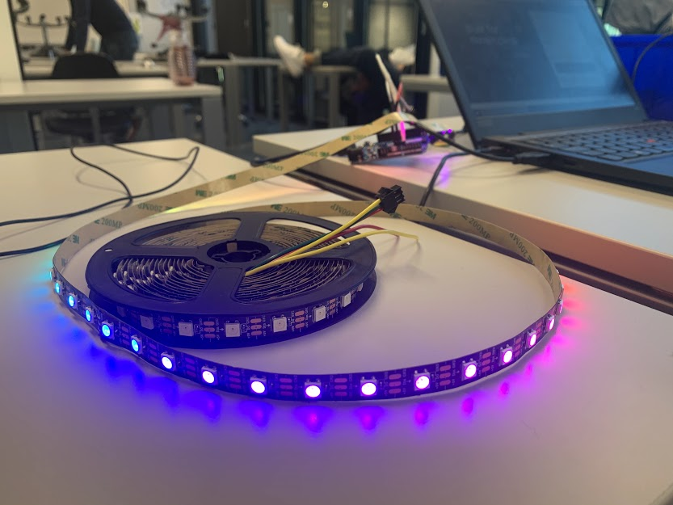
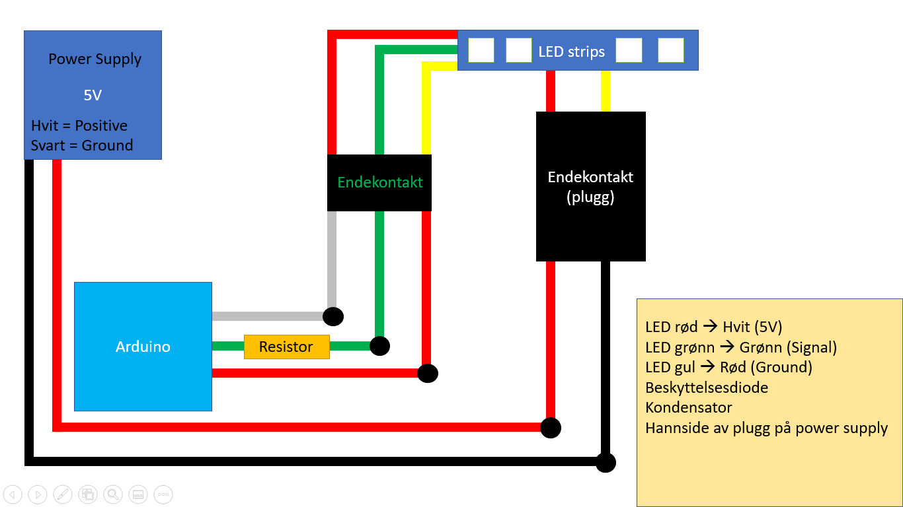
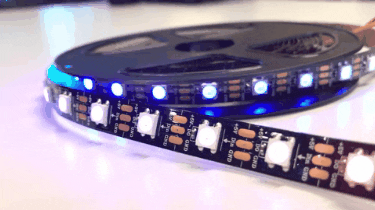

# Adresserbar LED stripe
Hvordan koble opp og programmere en adresserbar LED strip.

## Ressurser
- [Guide](https://learn.adafruit.com/adafruit-neopixel-uberguide/powering-neopixels) for å finne vilken kondensator vi skulle bruke
- [Guide](https://www.markdownguide.org/cheat-sheet/) for å gjøre denne side pen med markdown
- [FastLED](http://fastled.io/) laget koden for å styre LED stripen

## Todo:
- Legge til koblingsskjema
- Legge til instruksjoner for hvordan lodde stripen sammen
- laste opp eksempelkode

## Skjema:
- Koblingsskjema for Arduino, powersupply og LED stripe.

## Utstyrsliste:
- <a href="https://www.kjell.com/no/produkter/elektro-og-verktoy/utviklerkit/arduino/tilbehor/luxorparts-adresserbar-rgb-led-list-5-m-p87963">Luxorparts Adresserbar RGB LED-list 5 m</a> (type WS2812)
- <a href="https://uk.rs-online.com/web/p/push-button-complete-units/2258150/">Bryter</a> 
- <a href="https://www.elfadistrelec.no/no/mikrokontroller-leonardo-stiftlister-arduino-a000057/p/11038915">Arduino</a> (type Leonardo)
- <a href="https://www.netonnet.no/art/smarte-hjem/smarte-elektriske-artikler/smartkontakter/d-link-wi-fi-smart-plug-dsp-w118/1009478.16666/?utm_source=prisguide&utm_medium=cpc&utm_term=1009478%2B-%20D-Link%20Wi-Fi%20Smart%20Plug%20DSP-W118&utm_campaign=prospecting_conversion_prisguide-prisjamforelse_no&dclid=CNzV7ZjDse0CFU8EGQod7_ANdg">Smart Rele</a> (type WiFi) (eksempel link)

